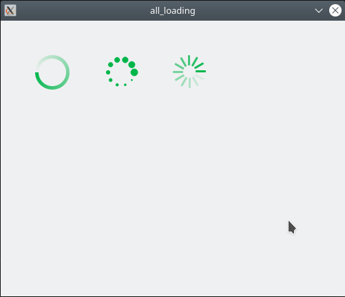

QtAllLoading
===========================
汇总基于 Qt 的各种 loading 特效代码。
****
	
|Author|徐昌隆|
|---|---
|E-mail|xclsoftware@163.com

****

### 一、目录介绍
****
|目录|内容|
|---|---	
|code|窗体源码
|package|制作 deb 的脚本

****
### 二、使用方法
#### 1、生成测试程序
```
cd code
mkdir build && cd buid
cmake .. && make
./cmake_base_qt
```
#### 2、生成 deb
```
sh build.sh
```
#### 3、结果
